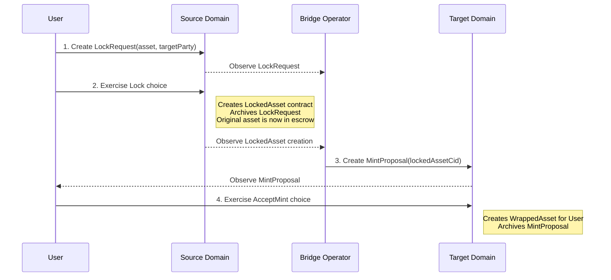
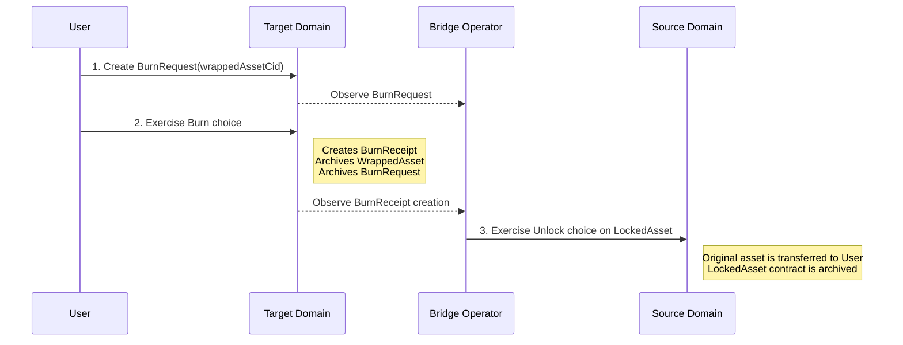

# Canton Cross-Chain Bridge Protocol (CCBP)

This document specifies the protocol for transferring assets between two distinct Canton domains using a lock-mint-burn mechanism. The protocol relies on a trusted Bridge Operator (or Notary) to facilitate the cross-domain communication and asset wrapping.

## 1. Overview

The Canton Cross-Chain Bridge enables users to move assets from a "Source Domain" to a "Target Domain" and back. This is achieved without true cross-domain transactions, but rather by representing the asset on the target domain as a wrapped IOU.

The core mechanism is:
- **Lock & Mint**: An asset on the Source Domain is locked in an escrow contract controlled by the Bridge Operator. The Operator then mints a corresponding "wrapped" asset (an IOU) on the Target Domain and gives it to the user.
- **Burn & Unlock**: The user burns the wrapped asset on the Target Domain. The Bridge Operator observes this event and subsequently unlocks the original asset on the Source Domain, returning it to the user.

This model ensures that every wrapped asset on the Target Domain is 1:1 backed by a corresponding locked asset on the Source Domain.

## 2. Participants

- **User**: The party who owns an asset and wishes to transfer it across domains. The User must have a party identity on both the Source and Target domains.
- **Bridge Operator**: A trusted, central entity responsible for operating the bridge. The Operator has a party identity on both domains and runs an off-ledger service (e.g., using Canton Triggers or a custom application) to monitor and react to events on both ledgers. The security of the bridge relies on the honesty and liveness of the Operator.
- **Source Domain**: The Canton domain where the original, canonical asset exists.
- **Target Domain**: The Canton domain where the wrapped representation of the asset (IOU) is minted and circulated.

## 3. Protocol Flow

The protocol consists of two primary workflows: transferring an asset from the Source to the Target domain, and returning it from the Target to the Source domain.

### 3.1 Flow A: Source Domain -> Target Domain (Lock & Mint)

This flow moves an asset from the Source Domain to the Target Domain.

**Step-by-step breakdown:**

1.  **Initiation (Source Domain)**: The User initiates the transfer by creating a `LockRequest` contract. This contract specifies the original asset's `ContractId`, the user's `Party` on the Target Domain, and the Bridge Operator's `Party`. The Bridge Operator is an observer on this contract.

2.  **Asset Lock (Source Domain)**: The User exercises the `Lock` choice on the `LockRequest`. This is an atomic transaction that:
    - Archives the `LockRequest`.
    - Creates a `LockedAsset` contract. This contract holds the original asset `ContractId` in escrow.
    - The `LockedAsset` contract has the **Bridge Operator as the signatory**, giving them exclusive control over the asset. The User is an observer to retain visibility.

3.  **Attestation & Proposal (Target Domain)**: The Bridge Operator's off-ledger service observes the creation of the `LockedAsset` contract on the Source Domain. This serves as cryptographic proof that the asset is secured. The Operator then acts on the Target Domain:
    - It creates a `MintProposal` contract.
    - This proposal is offered to the User's Target Domain party. It contains details of the lock, including the `ContractId` of the `LockedAsset` contract on the Source Domain, ensuring a clear audit trail.

4.  **Claim Wrapped Asset (Target Domain)**: The User sees the `MintProposal` on the Target Domain and accepts it by exercising the `AcceptMint` choice. This transaction atomically:
    - Archives the `MintProposal`.
    - Creates a `WrappedAsset` contract, with the User as the owner. This contract represents the IOU and can now be freely used on the Target Domain.

### 3.2 Flow B: Target Domain -> Source Domain (Burn & Unlock)

This flow returns the asset to its original Source Domain.

**Step-by-step breakdown:**

1.  **Initiation (Target Domain)**: The User decides to redeem their wrapped asset for the original. They create a `BurnRequest` contract, specifying the `ContractId` of the `WrappedAsset` they wish to burn. The Bridge Operator is an observer.

2.  **Asset Burn (Target Domain)**: The User exercises the `Burn` choice on the `BurnRequest`. This is an atomic transaction that:
    - Archives the `BurnRequest`.
    - Archives the user's `WrappedAsset` contract, removing it from circulation.
    - Creates a `BurnReceipt` contract, co-signed by the User and the Bridge Operator. This receipt is an immutable, on-ledger proof that the wrapped asset was destroyed.

3.  **Attestation & Unlock (Source Domain)**: The Bridge Operator's service observes the creation of the `BurnReceipt` on the Target Domain. With proof of burn, the Operator acts on the Source Domain:
    - It finds the corresponding `LockedAsset` contract (identifiable via the information stored within the `BurnReceipt` which links back to the original lock).
    - The Operator exercises the `Unlock` choice on the `LockedAsset` contract. This choice is only available to the Operator.

4.  **Claim Original Asset (Source Domain)**: The `Unlock` choice atomically transfers the original asset held in escrow back to the User's Source Domain party and archives the `LockedAsset` contract. The bridge process is now complete.

## 4. Security & Trust Assumptions

The security of the bridge is predicated on the following assumptions:

1.  **Trusted Bridge Operator**: The Bridge Operator is the central point of trust. It must be honest and must not:
    - Mint wrapped assets without a corresponding locked asset (theft via inflation).
    - Refuse to unlock assets after a valid burn (censorship/griefing).
    - Unlock assets without a corresponding burn (theft).
    The protocol's Daml implementation enforces the link between lock/mint and burn/unlock, but the Operator's liveness and honesty are paramount.

2.  **Canton Domain Integrity**: Both the Source and Target Domains are assumed to be secure, non-compromised Canton networks operating as expected.

3.  **Canton Transaction Finality**: The protocol relies on Canton's guarantee of transaction finality. Once a transaction creating a `LockedAsset` or `BurnReceipt` is committed to the ledger, it cannot be reversed. This eliminates the complexities of chain re-organizations present in many public blockchain bridges.

4.  **Operator Liveness**: The bridge's liveness depends on the Operator's off-ledger service being online to observe events and submit the necessary cross-domain transactions. If the Operator's service goes down, the bridge will halt, but no funds will be lost. Locked assets will remain locked, and wrapped assets will remain on the target domain until the Operator resumes service.

## 5. Daml Contract States

- **`LockRequest`**: A short-lived contract proposed by the User to initiate an asset lock.
- **`LockedAsset`**: An escrow contract on the Source Domain holding the original asset. Signatory is the Bridge Operator.
- **`MintProposal`**: The Operator's proposal on the Target Domain to mint a wrapped asset for the User.
- **`WrappedAsset`**: The IOU token on the Target Domain, owned by the User.
- **`BurnRequest`**: A short-lived contract proposed by the User to initiate the burning of a `WrappedAsset`.
- **`BurnReceipt`**: An immutable proof-of-burn on the Target Domain, co-signed by the User and Operator.