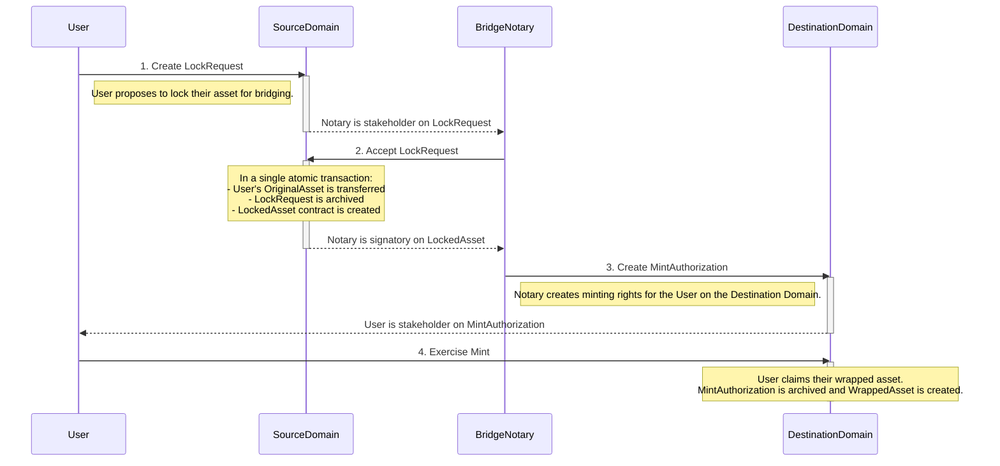
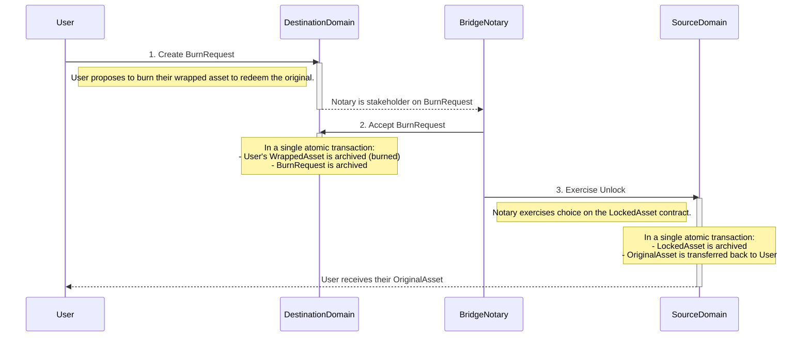

# Canton Cross-Chain Bridge Protocol Specification

This document outlines the protocol for transferring assets between two distinct Canton domains, referred to as the Source Domain and the Destination Domain. The bridge operates on a lock-mint and burn-unlock mechanism, facilitated by a trusted Bridge Notary.

## 1. Overview

The Canton Cross-Chain Bridge enables users to move assets from a Source Domain (e.g., a private bank ledger) to a Destination Domain (e.g., a DeFi ecosystem) and back. This is achieved by locking the original asset on the Source Domain and minting a corresponding "wrapped" asset (an IOU) on the Destination Domain. The wrapped asset is fully backed 1:1 by the locked original. To redeem the original asset, the user burns the wrapped asset, which authorizes the unlocking of the original asset on the Source Domain.

## 2. Actors

*   **User**: The party who owns an asset and wishes to transfer it across domains.
*   **Asset Issuer**: The original creator of the asset on the Source Domain (e.g., a commercial bank issuing tokenized deposits).
*   **Bridge Notary**: A trusted, central party that operates across both domains. The Notary is responsible for:
    *   Verifying that assets are correctly locked on the Source Domain.
    *   Authorizing the minting of corresponding wrapped assets on the Destination Domain.
    *   Verifying that wrapped assets are burned on the Destination Domain.
    *   Authorizing the unlocking of original assets on the Source Domain.

## 3. Core Concepts

*   **Source Domain**: The Canton domain where the original asset resides.
*   **Destination Domain**: The Canton domain where the wrapped asset will be minted and used.
*   **Original Asset**: The asset contract on the Source Domain. It is assumed to have standard transfer capabilities.
*   **Wrapped Asset**: A contract on the Destination Domain that represents a claim on a locked Original Asset. It is issued by the Bridge Notary.
*   **Lock/Unlock**: The process of escrowing and releasing the Original Asset on the Source Domain in a contract controlled by the Bridge Notary.
*   **Mint/Burn**: The process of creating and destroying the Wrapped Asset on the Destination Domain.

## 4. Protocol Flow: Source Domain → Destination Domain

This flow describes locking an asset on the source domain and minting a wrapped equivalent on the destination domain.

**Step-by-step Breakdown:**

1.  **Initiate Lock (User)**: The User creates a `LockRequest` contract on the **Source Domain**. This contract specifies the asset to be locked, the owner, the Bridge Notary, and the target destination address (the User's party ID on the Destination Domain).
2.  **Confirm Lock (Bridge Notary)**: The Bridge Notary, as a stakeholder on the `LockRequest`, accepts the proposal. This choice atomically:
    *   Transfers the User's `OriginalAsset` to be held within a new `LockedAsset` contract.
    *   Makes the Bridge Notary the signatory of the `LockedAsset` contract, effectively placing the asset in escrow.
    *   Archives the `LockRequest`.
3.  **Authorize Mint (Bridge Notary)**: Having observed the creation of the `LockedAsset` contract on the Source Domain, the Bridge Notary creates a `MintAuthorization` contract on the **Destination Domain**. This contract grants the User the right to mint a corresponding amount of the wrapped asset.
4.  **Mint Wrapped Asset (User)**: The User exercises the `Mint` choice on the `MintAuthorization` contract. This atomically archives the `MintAuthorization` and creates a `WrappedAsset` contract, owned by the User, on the Destination Domain.

## 5. Protocol Flow: Destination Domain → Source Domain

This flow describes burning the wrapped asset on the destination domain to unlock the original asset on the source domain.

**Step-by-step Breakdown:**

1.  **Initiate Burn (User)**: The User, holding a `WrappedAsset` on the **Destination Domain**, creates a `BurnRequest` proposing to burn it in exchange for their original asset.
2.  **Confirm Burn (Bridge Notary)**: The Bridge Notary accepts the `BurnRequest`. This choice atomically archives (burns) the User's `WrappedAsset` contract.
3.  **Unlock Original Asset (Bridge Notary)**: Having witnessed the burning of the `WrappedAsset` on the Destination Domain, the Bridge Notary exercises the `Unlock` choice on the corresponding `LockedAsset` contract on the **Source Domain**. This atomically transfers the `OriginalAsset` back to the User and archives the `LockedAsset` contract, completing the redemption.

## 6. Security & Trust Assumptions

*   **Honest Bridge Notary**: The security of the bridge relies entirely on the assumption that the Bridge Notary is honest and operationally secure. A malicious or compromised Notary could:
    *   Mint unbacked wrapped assets (inflation).
    *   Refuse to unlock assets after they are burned (theft).
    *   Steal locked assets.
    The Bridge Notary is the central point of trust in this architecture.
*   **Canton Domain Integrity**: The protocol assumes the underlying security, liveness, and correctness of both the Source and Destination Canton domains. This includes the participant nodes, synchronizers, and mediators involved.
*   **User Liveness**: The user must be online to complete their half of the protocol (e.g., exercising the `Mint` choice). The protocol provides authorizations that can be exercised at a later time, mitigating short-term connectivity issues.

## 7. Finality Guarantees

The bridge's finality is built upon the strong finality guarantees of the underlying Canton protocol.

*   **Per-Domain Atomicity**: Every step within a single domain (e.g., accepting the `LockRequest` and creating the `LockedAsset`) is a single, atomic Canton transaction. It either completes successfully in its entirety or fails with no state change.
*   **Cross-Domain Consistency**: The overall bridge process is not a single atomic transaction. It is a sequence of causally-linked atomic transactions across two domains. Consistency is maintained because the trigger for an action on one domain is the observable, final state change on the other. For example, the `MintAuthorization` is only created *after* the `LockedAsset` is successfully and finally created on the Source Domain.
*   **Observability**: Canton's privacy model ensures that the Bridge Notary can securely observe state changes on both domains without revealing transaction details to unauthorized parties. The creation of `LockedAsset` and the archival of `WrappedAsset` are the key observable events that drive the protocol forward.